# KZT Forecast

Прогнозирование курса **USD/KZT** (казахстанский тенге) и акций с помощью [TimesFM 2.5](https://github.com/google-research/timesfm) — foundation-модели временных рядов от Google Research (200M параметров, контекст до 16k, квантильные прогнозы).

Данные загружаются автоматически через [yfinance](https://github.com/ranaroussi/yfinance).

---

## Установка

```bash
pip install -r requirements.txt
```

## Быстрый старт

```bash
python kzt_forecast.py
```

---

## Прогнозы курса USD/KZT

### `kzt_forecast.py` — Прогноз на 7 дней

Базовый прогноз курса тенге на 7 дней вперёд с доверительным интервалом (10-90%) и rolling evaluation за последние 30 окон. Показывает полную историю курса с 2020 года, текущий прогноз и посуточную ошибку модели.

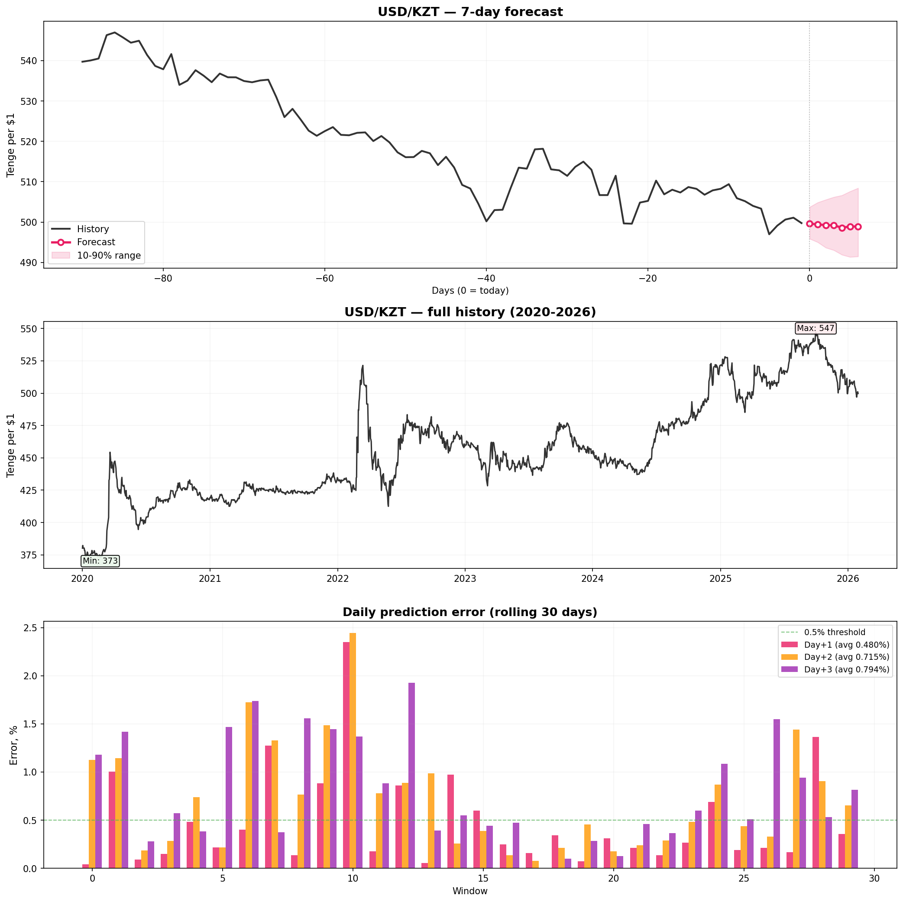

---

### `kzt_smart.py` — Мульти-факторный прогноз

Умный прогноз, учитывающий макроэкономические факторы, влияющие на тенге:
- **Brent Oil** — Казахстан = нефтяная страна
- **USD/RUB** — главный торговый партнёр
- **Gold** — резервы Нацбанка
- **DXY** — индекс доллара
- **Copper** — экспорт Казахстана
- **S&P 500** — аппетит к риску
- **USD/CNY** — торговля с Китаем

Каждый фактор прогнозируется отдельно, рассчитываются корреляции, и строится ансамблевый прогноз (base + factors + ensemble).

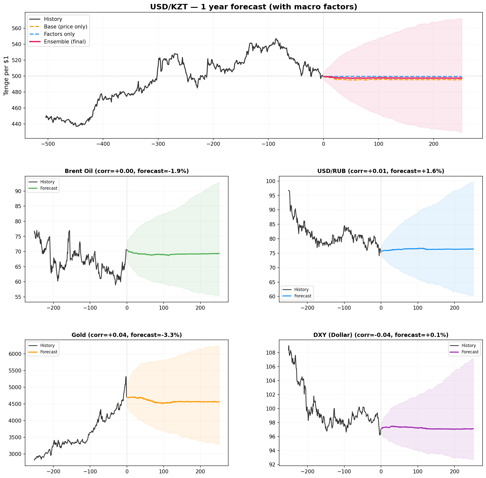

---

### `kzt_yearly.py` — Годовой прогноз

Прогноз USD/KZT на 252 торговых дня (~1 год) за один вызов модели. Показывает квартальные milestone'ы (Q1-Q4), доверительные интервалы 10-90% и 20-80%, и ожидаемое изменение курса в процентах.

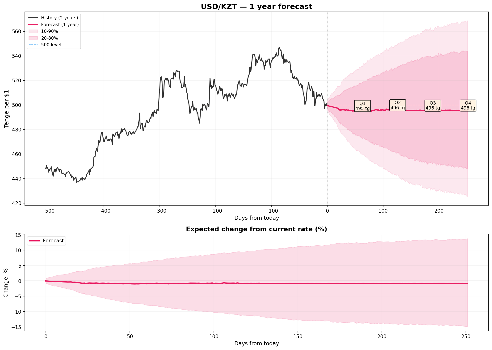

---

## Прогнозы акций (AAPL, TSLA, GOOG)

### `replot.py` — 30-дневный прогноз акций

Простой график: история, прогноз на 30 дней и фактические цены для сравнения.

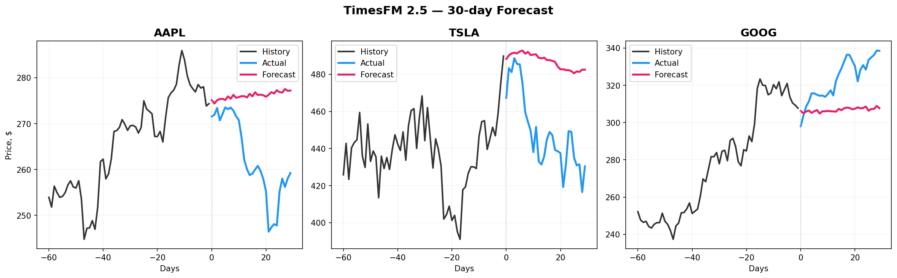

---

### `daily_dashboard.py` — Ежедневный дашборд

Для каждого из 30 дней модель делает прогноз на 3 дня вперёд. Показывает forecast vs actual и посуточную ошибку (MAPE). Средние ошибки: AAPL 0.74%, TSLA 1.96%, GOOG 1.01%.

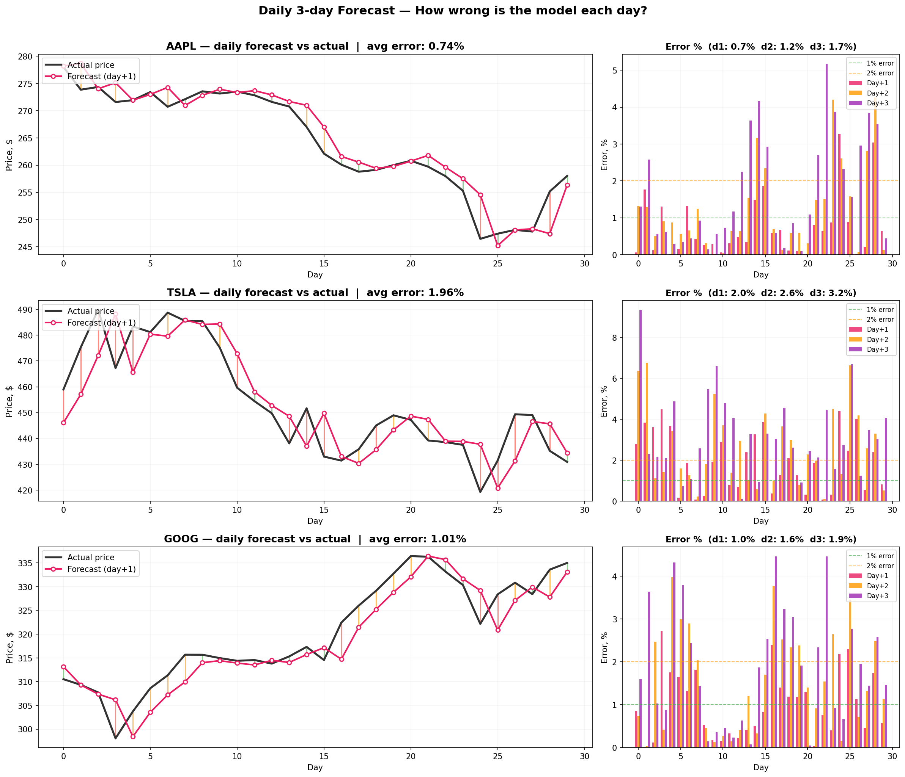

---

### `rolling_eval.py` — Rolling evaluation

Скользящий 3-дневный прогноз по 30 окнам. Для каждого окна сдвигаем контекст на 1 день, прогнозируем на 3 дня и сравниваем с фактом. MAPE: AAPL 1.23%, GOOG 1.49%, TSLA 2.61%.

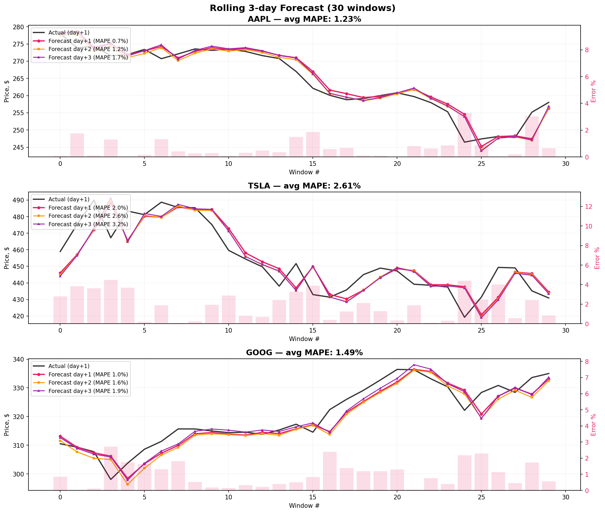

---

## Бэктесты торговых стратегий

### `backtest.py` — Model vs Buy & Hold

Простой бэктест: $10,000 стартовый капитал, 60 торговых дней. Если модель говорит "завтра вырастет" — покупаем, "упадёт" — не покупаем. Комиссия 0.1% за сделку. Сравнение с Buy & Hold и отслеживание direction accuracy (>50% = модель полезна).

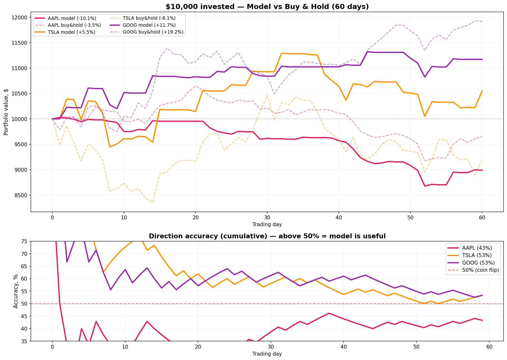

---

### `smart_backtest.py` — Smart Broker Strategy

Умная стратегия с техническими фильтрами поверх прогноза модели:
- **Фильтр уверенности** — торгуем только при сильном сигнале
- **Объём** — покупаем при объёме выше среднего
- **RSI** — не покупаем перекупленное (>70), не продаём перепроданное (<30)
- **MA20 тренд** — торгуем только по тренду
- **Stop-loss** — выход при -2% от входа

Сравнение трёх подходов: Smart Broker vs Dumb Model vs Buy & Hold.

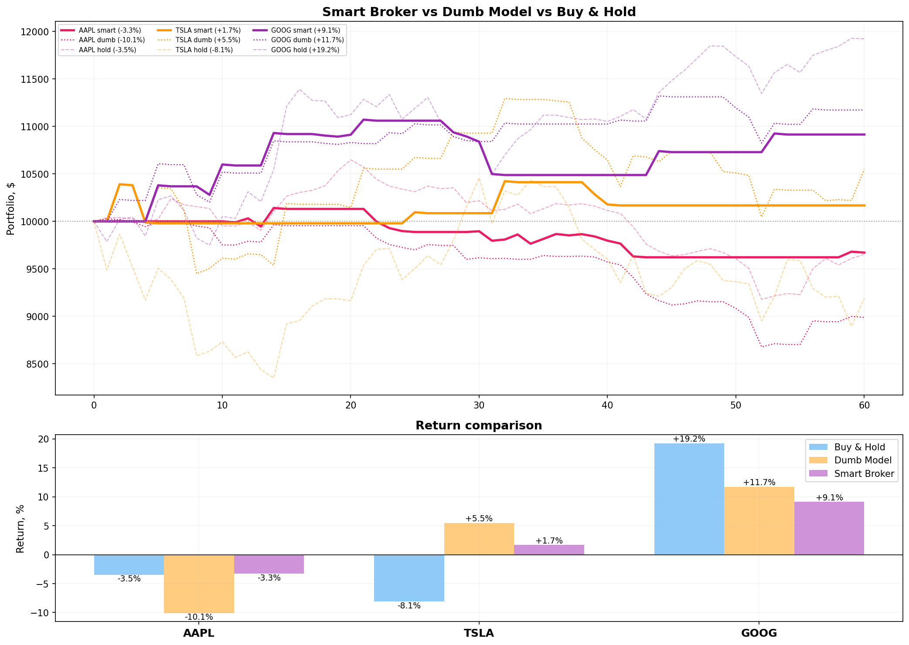

---

### `multi_signal_backtest.py` — Мульти-сигнальный бэктест

Модель прогнозирует цену, а рыночные сигналы подтверждают или отменяют сделку:
- **SPY** — общий рынок
- **VIX** — индекс страха
- **GLD** — золото
- **USO** — нефть
- **BTC-USD** — биткоин
- **DX-Y.NYB** — доллар
- **TLT** — облигации 10Y

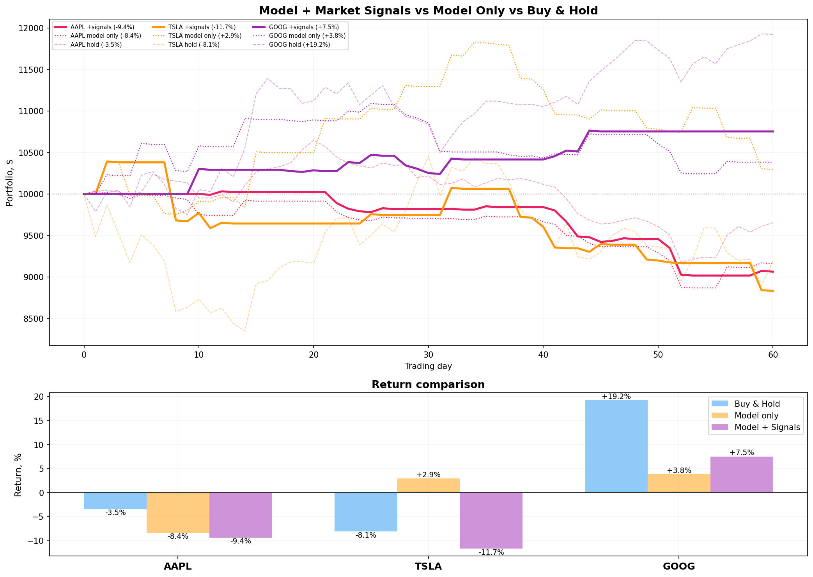

---

## Fine-tuning модели

### `test_run.py` — Тестовый прогон

Базовый инференс + fine-tuning на синтетических данных. Проверка работоспособности модели и pipeline'а обучения.

---

### `test_real_data.py` — Fine-tuning на реальных данных

Загрузка реальных акций через yfinance, инференс и fine-tuning. Сравнение MAE до и после обучения.

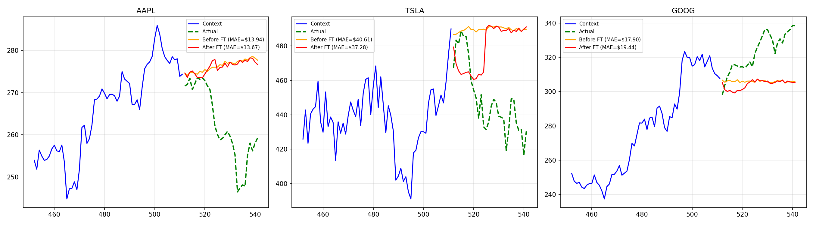

---

### `test_improved.py` — Улучшенный fine-tuning

Продвинутая версия с тремя улучшениями:
1. **Контекст 1024** (32 патча) вместо 128
2. **Разморозка 4 последних transformer-слоёв** + output head
3. **Huber + Quantile loss** вместо MSE

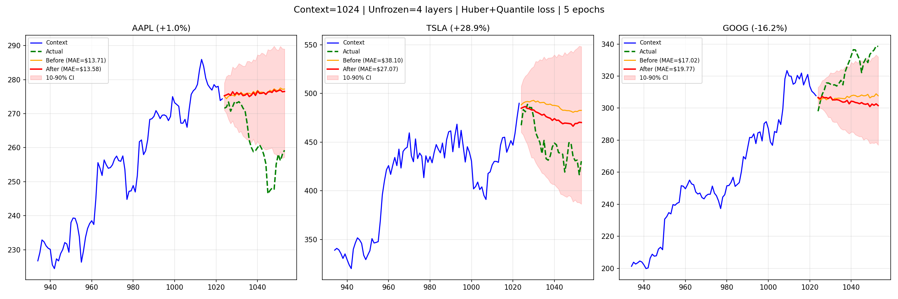

---

### Сравнение результатов fine-tuning

| | До FT | После FT |
|--|-------|----------|
| Прогноз | 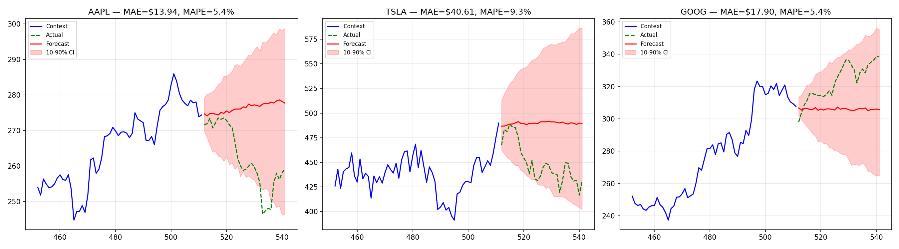 | 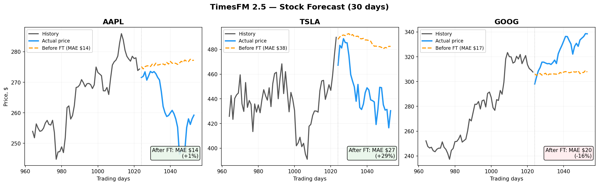 |

---

## Примеры применения

### `real_use_cases.py` — Где TimesFM работает лучше всего

90-дневный прогноз на четырёх типах временных рядов:
- **Продажи магазина** — недельная + годовая сезонность (MAPE: 1.4%)
- **Температура** — сильная годовая сезонность (MAPE: 150% — модель не для этого)
- **Веб-трафик** — дневные паттерны (MAPE: 1.6%)
- **Электричество** — потребление энергии (MAPE: 1.2%)

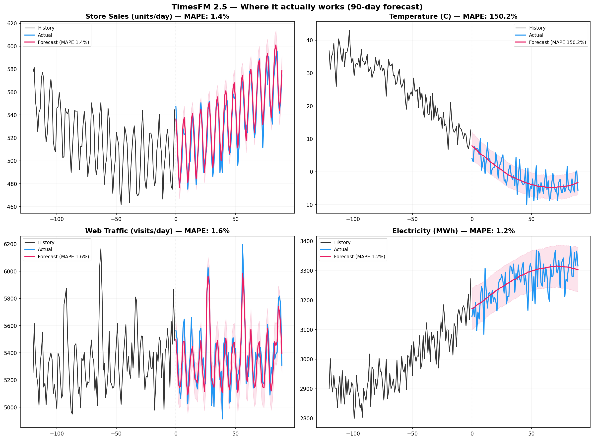

---

## Структура проекта

```
kzt-forecast/
  kzt_forecast.py          # Прогноз USD/KZT на 7 дней
  kzt_smart.py             # Мульти-факторный прогноз тенге
  kzt_yearly.py            # Годовой прогноз тенге
  daily_dashboard.py       # Ежедневный дашборд акций
  rolling_eval.py          # Rolling evaluation точности
  replot.py                # Простой прогноз акций
  backtest.py              # Бэктест: Model vs Buy & Hold
  smart_backtest.py        # Smart Broker Strategy
  multi_signal_backtest.py # Мульти-сигнальный бэктест
  real_use_cases.py        # Где TimesFM работает
  test_run.py              # Тестовый прогон
  test_real_data.py        # Fine-tuning на реальных данных
  test_improved.py         # Улучшенный fine-tuning
  requirements.txt         # Зависимости
  *.png                    # Графики результатов
```

## Модель

[TimesFM 2.5](https://huggingface.co/google/timesfm-2.5-200m-pytorch) (Google Research)
- 200M параметров
- Контекст до 16k точек
- Квантильные прогнозы (10th-90th percentile)
- [Paper: A decoder-only foundation model for time-series forecasting](https://arxiv.org/abs/2310.10688) (ICML 2024)

## Лицензия

MIT
